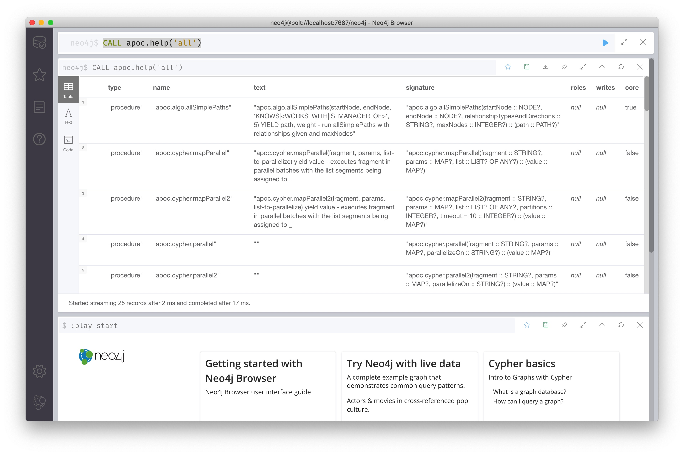
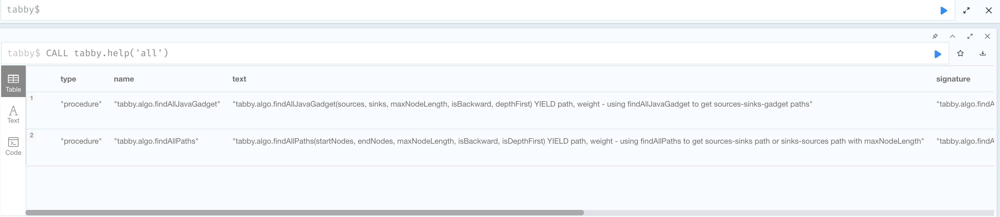
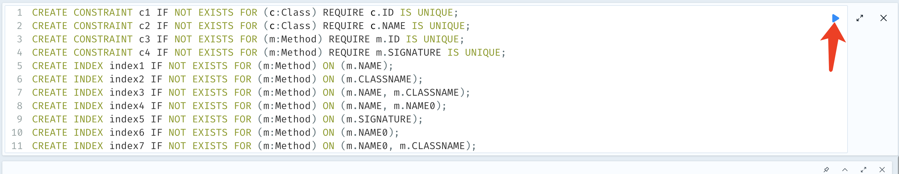

# Tabby

[中文版本](https://github.com/wh1t3p1g/tabby/blob/master/README.md)


We are delighted to announce that Tabby has been recognized by the academic community and accepted for publication in The 53rd Annual IEEE/IFIP International Conference on Dependable Systems and Networks (DSN 2023). The conference acceptance list, which includes our work, can be found at https://dsn2023.dei.uc.pt/program_research.html.

Tabby is a Java Code Analysis Tool based on [Soot](https://github.com/soot-oss/soot) .

It can parse JAR/WAR/CLASS files to CPG (Code Property Graph) based on [Neo4j](https://neo4j.com/) .

## #1. Environment

Tabby requires the following environment
- JDK >= 8
- Neo4j 

## #2. Compile tabby

./gradlew bootJar

## #3. Neo4j 

### quick start

Note: You can use the Dockerfile in the ```env``` directory to build Neo4j.

### step 1. Download Neo4j (version 5.x)

[Download](https://neo4j.com/download/)

### step 2.  Download APOC Plugin

- apoc-core          https://github.com/neo4j/apoc
- apoc-extended  https://github.com/neo4j-contrib/neo4j-apoc-procedures

Move the two plugins into the Neo4j plugin directory.

### step 3. tabby-path-finder

Compile tabby-path-finder into jar file.

Move  tabby-path-finder.jar into the Neo4j plugin directory.


### step 3. Modify the neo4j configuration file

Modify the configuration file ``/conf/neo4j.conf`` as follows

```
#server.directories.import=import
initial.dbms.default_database=tabby

dbms.security.procedures.unrestricted=jwt.security.*,tabby.*,apoc.*


# Configure this according to your computer's performance
# https://neo4j.com/docs/operations-manual/current/tools/neo4j-admin/neo4j-admin-memrec/
server.memory.heap.initial_size=4G # this can be expanded to suit your needs
server.memory.heap.max_size=6G # this can be expanded to suit your needs
db.memory.transaction.max=6G   # this can be expanded to suit your needs
```

touch /conf/apoc.conf and write the following to apoc.conf

```
apoc.import.file.enabled=true
apoc.import.file.use_neo4j_config=false
```


## # 4. Configure Tabby

Modify conf/settings.properties of Tabby as follows

```
tabby.neo4j.username                      = neo4j  
tabby.neo4j.password                      = password  
tabby.neo4j.url                           = bolt://127.0.0.1:7687
```


## # 5. Check if the configuration is successful

``./neo4j start``

Note: You can use Neo4j with your browser by visiting 127.0.0.1:7474

 `CALL apoc.help('all')`



 `CALL tabby.help('all')`




## # 6. Create the  database indexes

Note: You must finish this step.

```sql
CREATE CONSTRAINT c1 IF NOT EXISTS FOR (c:Class) REQUIRE c.ID IS UNIQUE;
CREATE CONSTRAINT c2 IF NOT EXISTS FOR (c:Class) REQUIRE c.NAME IS UNIQUE;
CREATE CONSTRAINT c3 IF NOT EXISTS FOR (m:Method) REQUIRE m.ID IS UNIQUE;
CREATE CONSTRAINT c4 IF NOT EXISTS FOR (m:Method) REQUIRE m.SIGNATURE IS UNIQUE;
CREATE INDEX index1 IF NOT EXISTS FOR (m:Method) ON (m.NAME);
CREATE INDEX index2 IF NOT EXISTS FOR (m:Method) ON (m.CLASSNAME);
CREATE INDEX index3 IF NOT EXISTS FOR (m:Method) ON (m.NAME, m.CLASSNAME);
CREATE INDEX index4 IF NOT EXISTS FOR (m:Method) ON (m.NAME, m.NAME0);
CREATE INDEX index5 IF NOT EXISTS FOR (m:Method) ON (m.SIGNATURE);
CREATE INDEX index6 IF NOT EXISTS FOR (m:Method) ON (m.NAME0);
CREATE INDEX index7 IF NOT EXISTS FOR (m:Method) ON (m.NAME0, m.CLASSNAME);
```



## # 7. introduction of the tabby profile

conf/settings.properties

### overview

```properties
# enables  
tabby.build.enable                        = true  
tabby.load.enable                         = true  
tabby.cache.compress                      = false  
# debug  
tabby.debug.details                       = false  
  
# jdk settings  
tabby.build.isJDKProcess                  = true  
tabby.build.withAllJDK                    = true  
tabby.build.excludeJDK                    = false  
tabby.build.isJDKOnly                     = false  
  
# dealing fatjar  
tabby.build.checkFatJar                   = true  
  
# pointed-to analysis  
tabby.build.isFullCallGraphCreate         = false  
tabby.build.thread.timeout                = 2  
tabby.build.isNeedToCreateIgnoreList      = false  
  
# targets to analyse  
tabby.build.target                        = cases/target/ # your targets dir
tabby.build.libraries                     = libs  
tabby.build.mode                          = gadget # mode with `web` or `gadget`  
  
# db settings  
tabby.cache.directory                     = ./cache
tabby.cache.db.filename                   = dev
tabby.cache.isDockerImportPath            = false
tabby.cache.auto.remove                   = true
tabby.cache.compress.times                = 1
  
tabby.neo4j.username                      = neo4j  
tabby.neo4j.password                      = password  
tabby.neo4j.url                           = bolt://127.0.0.1:7687
```


### modify

Modify the configuration file to suit your needs

```properties
# jdk settings
tabby.build.isJDKProcess                  = false # true (if you want to add the two base dependency libraries of jdk)
tabby.build.withAllJDK                    = false # true (if you want to add all of the dependency libraries of jdk)
tabby.build.excludeJDK                    = false # true (exclude jdk dependencies from the current runtime environment, but the target directory needs to provide the jdk dependencies to be analysed)
tabby.build.isJDKOnly                     = false # true (if you want to analyze only the jdk dependencies and not the files in the target directory)
tabby.build.target                        = cases/targets_dir # your targets dir
```


## # 8. Launch

1. start your neo4j ``./neo4j start``
2. start Tabby ``java -jar tabby.jar``
3. Happy Hunting Bugs! XD


## # 9. Achievements

+ CVE-2021-21346
+ CVE-2021-21351
+ CVE-2021-39147
+ CVE-2021-39148
+ CVE-2021-39152
+ CVE-2021-43297
+ CVE-2022-39198
+ CVE-2023-23638


